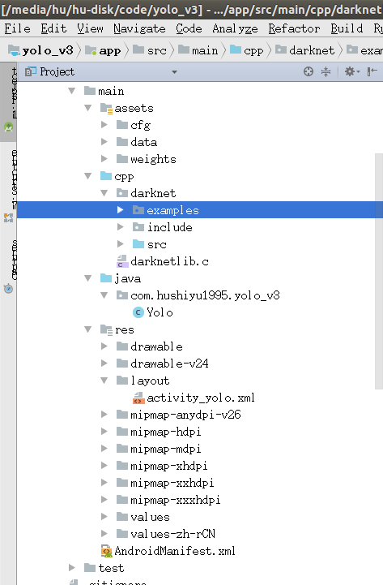
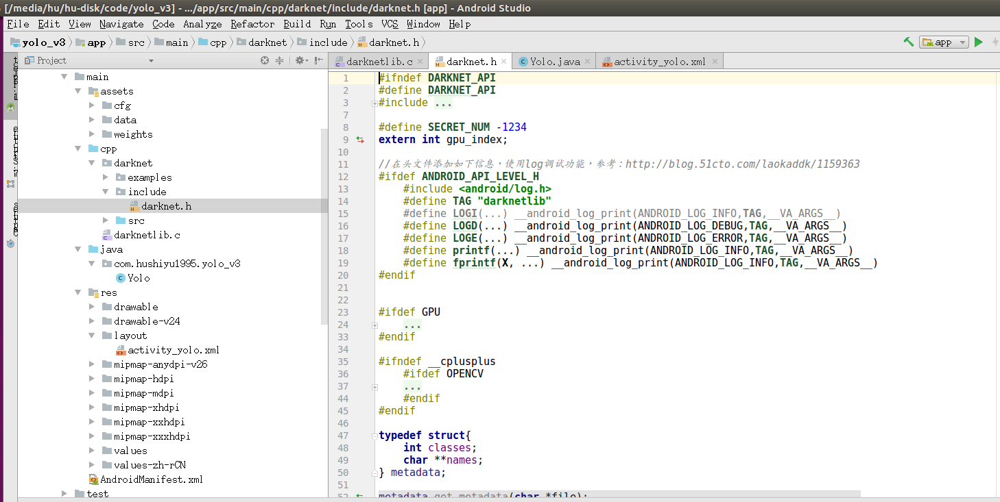
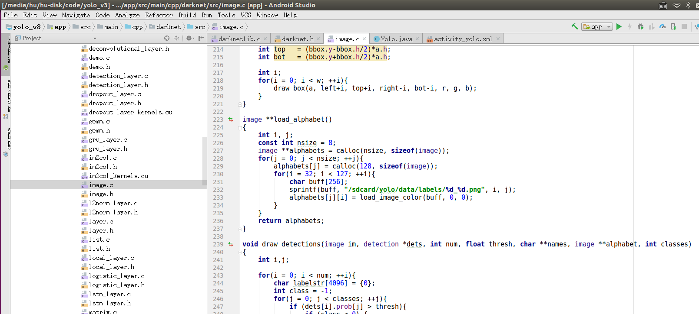
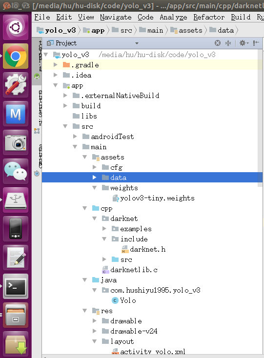
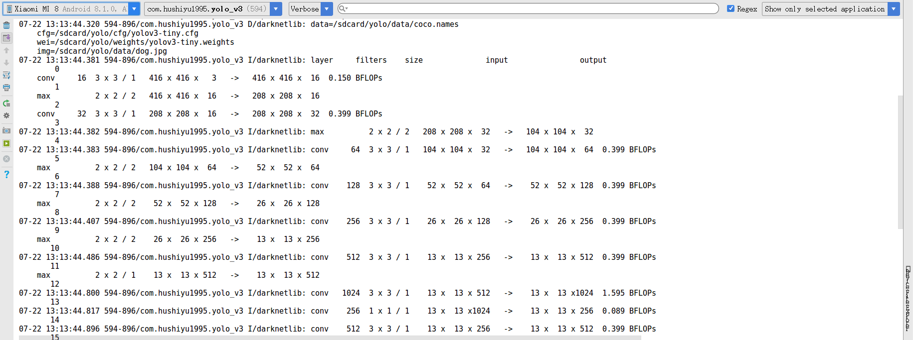
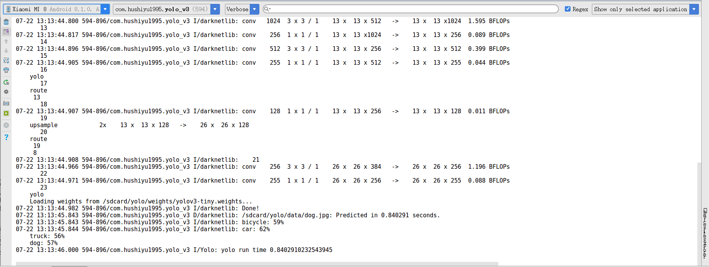
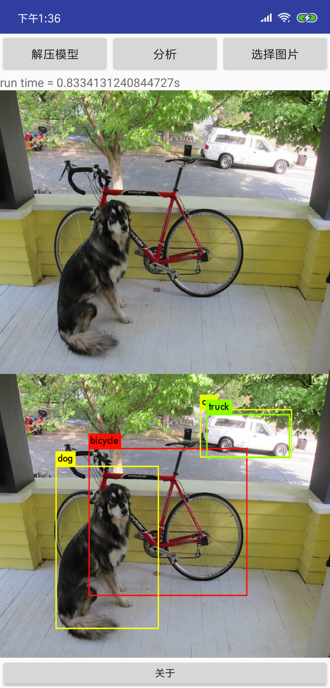

# I. 介绍

本项目将Yolo-v3的源代码在android studio进行开发编译并且部署到android手机上，实现利用手机硬件平台完成对Yolo-v3网络的调用．项目以Yolo-v3-tiny为例子进行开发，其他相关网络可以通过Darknet网站下载权重文件进行复现．

# II. 开发环境

OS: Ubuntu 16.04

Android Studio: 3.1.3

Mobile Phone: Xiaomi MI 8

相关教程：

[ubuntu下安装AndroidStudio方法](https://blog.csdn.net/qibin0506/article/details/50755202)

[Andorid Studio官网安装教程](https://developer.android.com/studio/install?hl=zh-cn)

请自行查阅教程完成Android Studio安装以及NDK, SDK等相关开发环境的配置．

# III. 项目构建

## 3.1 源码导入
在Andorid Studio构建一个支持C语言的项目，然后从[Darknet](https://github.com/pjreddie/darknet)下载源代码．

在项目工程的cpp文件夹下新建darknet文件夹，将下载的源码中的example, include, src三个文件夹复制到android工程中．

## 3.2　源码修改

### 3.2.1 include文件夹

include文件夹下放置的是darknet的头文件，在头文件开头添加log调试功能．

### 3.2.2 src文件夹

src文件夹放置darknet源码，首先删除其中的compare.c文件(compare.c无头文件，对整个库的编译不起作用．如果不删除，在编译时compare.c会出现指针问题，无法通过编译)．然后修改image.c文件，将232行的load_alphabet()函数中的labels路径改为sdcard/yolo/data/labels(这是随后将在手机上放置文件的绝对路径，不做修改的话真机测试时将出现无法导入labels的问题，导致出现闪退现象)．

## 3.2 Cmake文件配置

关于Cmake的格式和用法，请参考：

[官方指南](https://cmake.org/cmake/help/v3.12/manual/cmake.1.html)

[CMake的基本使用](https://www.jianshu.com/p/a5bb1db05967)

[cmake 基本命令 & 交叉编译配置 & 模块的编写](https://blog.csdn.net/GW569453350game/article/details/46683845)

[cmake的使用笔记](https://blog.csdn.net/cartzhang/article/details/21518253)

本项目中Cmake配置信息请参考代码中CMakeLists.txt文件．

### 3.3 asserts文件夹配置

将darknet源码中的cfg,data文件放置在项目的assert文件夹下．

从[官网](https://pjreddie.com/darknet/yolo/)下载[YOLOV3-tiny](https://pjreddie.com/media/files/yolov3-tiny.weights)权重文件并放置在weights文件夹下．

### 3.4 JNI接口配置

关于在Android Studio 3中如何构建JNI项目，请参考[Android Jni/NDK 开发入门详解](https://www.jianshu.com/p/b294b3878192).

本项目主要修改darknetlib.c文件，其中图片测试代码摘自darknet/examples/dector.c Line562~Line626的官方代码示例．详细信息请参考项目代码及注释．

其中datacfg_str和name_list = "/sdcard/yolo/data/coco.names"，是因为项目所使用的预训练模型来自于[官网](https://pjreddie.com/darknet/yolo/),其中yolo-v3-tiny是用coco训练集训练出的80分类模型，因此name_list需要和预训练模型保持一致．

cfgfile_str和weightfile_str放置cfg文件和weight文件的地址，根据下载的文件位置保持一致即可．

### 3.5 Java配置

对java文件夹下Yolo.java进行修改，完成相关配置．

IV. 项目运行

在小米8上运行项目，在android studio 3的logcat中可以看到读入的文件信息，以及Yolo-v3-tiny网络的配置．

logcat会打印出预测出的物体名称，概率及处理时间．

在不同的图片上测试，使用手机cpu处理约为一张图耗时0.8s．

# 参考

项目参考[Darknet yolo 在 android studio上的移植和实现](https://blog.csdn.net/chentyjpm/article/details/79326118)，原博主实现的是Yolo-v2的移植，本项目进行修改后实现Yolo-v3版本代码的Android端复现．

